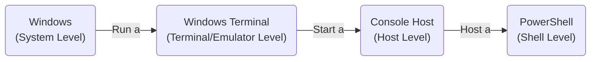
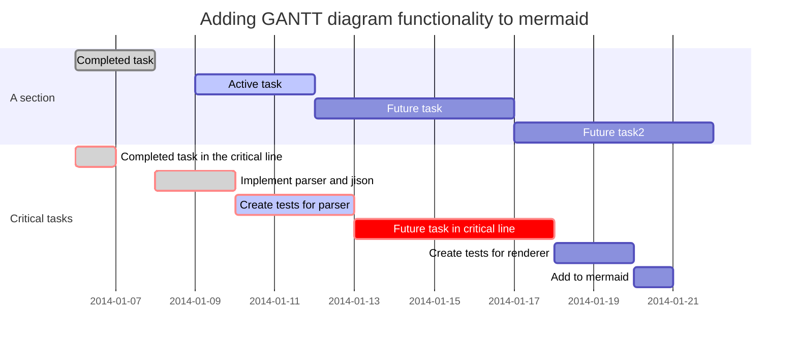

用于测试关键的若干Markdown语法或Markdown标记是否被正确渲染为预期的html。

当前渲染工具:

- Hexo 框架
  - 主题: Butterfly
  - Markdown渲染器: pandoc
    - 自定义pandoc过滤器，适用于markdown 到 markdown 的预处理
    - 自定义pandoc过滤器，适用于markdown 到 html 的最终生成
    - 未来减轻开发负担，不要求渲染器所有功能与本文的测试一一对应。
    - 行文时，若遇到一些拿不准的特性，始终只以本文被渲染前后的结果为依据。

<!-- more -->

# 引用链接

## 超链接

语法：`[Link Text](link-address)`

效果：[Links - Typora Support
(typoraio.cn)](https://support.typoraio.cn/Links/)

## 参考链接

语法：

``` markdown
[Link Text][Ref2] 

[Ref2]: https://support.typoraio.cn/Links/  "typora links"
```

效果（自动转为普通超链接）：

[Link Text](https://support.typoraio.cn/Links/ "typora links")

## 自动链接和网址

语法：`<http://typora.io>`

效果：<http://typora.io>

语法：`This is a link: http://typora.io`

效果：This is a link: http://typora.io

## 本地资源链接

语法：参考[Links - Typora Support
(typoraio.cn)](https://support.typoraio.cn/Links/#link-to-local-files)

- 不确保非站内资源可行。

- 不应该支持非站内资源，但是难以排除这些目的之外的资源。

``` markdown
[404_page](../404.html)
[this_page](../posts/d36d5fbd.html)
```

[404_page](../404.html)

[this_page](../posts/d36d5fbd.html)

## 页内链接(链接到headings锚点和raw-HTML锚点)

- 当headings中含有大小写时，允许链接不区分大小写

  #### A.1

  ## Second_level

  [跳转到Second_level,#Second_level](#Second_level)

  [跳转到Second_level,#second_level](#second_level)

  ## ErJi目lu

  [跳转到ErJi目lu,#ErJi目lu](#ErJi目lu)

  [跳转到ErJi目lu,#erji目lu](#erji目lu)

  [\#a.1](#a.1)

- raw-HTML锚点与raw-HTML跳转

  ``` html
  <a id="anchor1"></a> Anchor

  <a href="#anchor1">Link to Anchor</a>
  ```

  定义raw-HTML锚点<a id="anchor1">anchor1</a>

  留白测试跳转

  留白测试跳转

  留白测试跳转

  留白测试跳转

  留白测试跳转

  <a href="#anchor1">raw-HTML跳转到 anchor1</a>

- 带有特殊字符时，简化并改变了一般的Markdown渲染html的规则

  - 不遵从Typora的[internal-links](https://support.typoraio.cn/Links/#internal-links)语法
  - 直接将原内容复制到`[]()`的`()`内即可
  - 推荐使用上述方式，也只保证上述方式是可行的
  - 其余方式可能会出现意外结果

  ## 带空格 和`特殊字符` [链接](http://typora.io) 用于%%%%￥￥￥￥跳转测试 空格

  ### aAa-b cC `Dd`, a#%&[xxx](yyy) Zzz \[xx\] (yy)

  留白测试跳转

  留白测试跳转

  留白测试跳转

  留白测试跳转

  留白测试跳转

  留白测试跳转

  留白测试跳转

  - 使用markdown语法的链接到headings锚点
    - [带空格 和`特殊字符` \[链接\](http://typora.io)
      用于%%%%￥￥￥￥跳转测试
      空格](#带空格 和`特殊字符` [链接](http://typora.io) 用于%%%%￥￥￥￥跳转测试 空格)
    - [aAa-b cC `Dd`, a#%&\[xxx\](yyy) Zzz \[xx\]
      (yy)](#aAa-b cC `Dd`, a#%&[xxx](yyy) Zzz \[xx\] (yy))
  - 使用raw-HTML链接到headings锚点
    - <a href="#带空格 和`特殊字符` [链接](http://typora.io) 用于%%%%￥￥￥￥跳转测试 空格">带空格
      和`特殊字符`…</a>
    - <a href="#aAa-b cC `Dd`, a#%&[xxx](yyy) Zzz \[xx\] (yy)">aAa-b…</a>

- 链接允许多重#号

  # 一级目录

  ## 二级目录

  ### 三级目录

  #### 四级目录

  ##### 五级目录

  ###### 六级目录

  [跳转到一级目录,且是单个#号,#一级目录](#一级目录)

  [跳转到一级目录但是2个#号,##一级目录](#一级目录)

  [跳转到二级目录但是单个#号,#二级目录](#二级目录)

  [跳转到二级目录但是2个#号,##二级目录](#二级目录)

  [跳转到三级目录但是单个#号,#三级目录](#三级目录)

  [跳转到三级目录但是3个#号,###三级目录](#三级目录)

  [跳转到四级目录但是单个#号,#四级目录](#四级目录)

  [跳转到四级目录但是4个#号,####四级目录](#四级目录)

  [跳转到五级目录但是单个#号,#五级目录](#五级目录)

  [跳转到五级目录但是5个#号,#####五级目录](#五级目录)

  [跳转到六级目录但是单个#号,#六级目录](#六级目录)

  [跳转到六级目录但是6个#号,######六级目录](#六级目录)

  <a href="#六级目录">raw-HTML跳转到六级目录但是6个#号</a>

- 锚点自动追加`-x`,
  `x`为数字以区分。从`-1`开始，重复时数字+1。链接可能带有`-x`结尾，当存在与链接内容(包括`-x`)完全一致的锚点时，跳转到该锚点，不存在这样的锚点时，跳转到与链接剔除`-x`后的内容完全一致的第`x`个锚点。即：

  - 优先全文匹配
  - 其次按序号匹配
  - 需要确保上述匹配过程，至少有一个锚点是存在的。若这样的锚点不存在，渲染器手动抛出异常提醒。

  ## hello

  二级目录 hello

  # hello

  一级目录 hello

  # hello-2

  一级目录 hello

  ### hello

  三级目录 hello

  ##### hello

  五级目录 hello

  ### hello

  三级目录 hello

  <a id="hello">hello</a>

  自定义锚点 hello

  [跳转到第1次出现的二级目录hello,#hello](#hello)

  [跳转到第1次出现的二级目录hello,#hello-0](#hello-0)

  [跳转到第1次出现的一级目录hello,#hello-1](#hello-1)

  [跳转到一级目录hello-2,#hello-2](#hello-2)

  [跳转到第3次出现的三级目录hello,#hello-3](#hello-3)

  [跳转到第4次出现的五级目录hello,#hello-4](#hello-4)

  [跳转到第5次出现的三级目录hello,#hello-5](#hello-5)

  [跳转到第6次出现的hello，自定义锚点也算在内,#hello-6](#hello-6)

  <a href="#hello-6">raw-HTML跳转到第6次出现的hello</a>

# 数学公式的基本概念

- 需要在pandoc生成命令中，添加 –mathjax 才能启用公式
- 公式中 `\label` 和`\tag`区别
  - `\label` 用于打上内部标签，配合引用`\ref{标签}`
  - `\tag`
    用于显式地对公式编号。是一种外部展示。文本课件公式的编号，和引用时对公式的指代。
  - 若`\ref{标签}`引用的公式最终没有tag，一般会出现???的显示

## 行内公式

需要严格按照`$xxxx$`的形式，`$`符号的的最近邻不能有空格，否则会存在部分或全部元素丢失。

- 正常情况：

  - `$e=mc^2 \rightarrow$`: $e=mc^2 \rightarrow$

- `$`符号的的最近邻有空格：

  - `$ \rightarrow$`: \$ \$

  - `$\inf $`: \$\$

## 公式块（行间公式）和自动编号

NOTICE: 统一采用 AMS规则

$$
\begin{equation}\label{lalla}\tag{abcd}
e=mc^2
\end{equation}
$$

`Use AMS Numbering Rule (where only certain environments produce numbered equations, as they would be in LaTeX).`

即只对：`equation`框定的模块且标注的公式自动编号

``` latex
\begin{equation}
e=mc^2
\end{equation}
```

$$
\begin{equation}\tag{1}
e=mc^2\\
\end{equation}
$$

$$
\begin{equation}\tag{2}
\cancel{\Delta}
\end{equation}
$$

## 公式块（行间公式）标注和引用

$$
\begin{equation}\label{eq1}\tag{3}
e=mc^2
\end{equation}
$$

对公式2的定义语法为：

``` latex
\begin{equation}\label{eq1}
e=mc^2
\end{equation}
```

此处使用语法`$公式\label{eq1}$`进行引用，效果为：引用 $公式\ref{eq1}$
此处使用语法`$公式\label{eq1}$`进行引用，效果为：引用 $公式\ref{lalla}$

## 公式块（行间公式）换行

使用`\displaylines{x+y\\y+z}`语法换行

$$
\displaylines{x+y\\y+z}
$$

使用`\\`换行

$$
x+y\\y+z
$$

使用`\\\\`换行

$$
x+y\\\\y+z
$$

使用`\newline`换行

$$
x+y\newline y+z
$$

使用`split` 块换行

$$
\begin{split}
&x+y \\
&y+z
\end{split}
$$

## 公式块（行间公式）中遇到中文

$$
x+y\\y+z
\\
这是中文\\
$$

# 代码高亮

`test`

## 编程语言

``` python
# Python 
import os
import sys
def test():
    print(os.name)
    print(sys.platform)
    print('Hello World!')
if __name__ == '__main__':
    test()
```

## Mermaid流程图





# 插入图片

## 位图

<figure>

<figcaption aria-hidden="true">自定义头像</figcaption>
</figure>

## 矢量图

<figure>

<figcaption aria-hidden="true">Level-of-concepts</figcaption>
</figure>

# Tags/Callouts



文字 或者 `markdown` 均可

[header links](#脚注)

链接 [typoraio.cn](https://support.typoraio.cn/Links/)

链接 [`typoraio.cn`](https://support.typoraio.cn/Links/)

公式 $E=mc^2$

$$
\begin{equation}\tag{4}
e=mc^2
\end{equation}
$$



# Tabs



<!-- tab -->

**This is Tab 1.** <!-- endtab -->

<!-- tab -->

**This is Tab 2.**

<!-- endtab -->
<!-- tab -->

**This is Tab 3.** <!-- endtab -->





<!-- tab 1 -->

**This is Tab 1.**

<!-- endtab -->
<!-- tab 22-->

**This is Tab 2.**

<!-- endtab -->
<!-- tab 333-->

**This is Tab 3.**

<!-- endtab -->





<!-- tab 1 -->

**This is Tab 1.**

<!-- endtab -->
<!-- tab 22-->

**This is Tab 2.**

<!-- endtab -->
<!-- tab 333-->

**This is Tab 3.**

<!-- endtab -->





<!-- tab 1 -->

**This is Tab 1.**

<!-- endtab -->
<!-- tab 22-->

**This is Tab 2.**

<!-- endtab -->
<!-- tab 333-->

**This is Tab 3.**

<!-- endtab -->



# 脚注

## 合并脚注

which1.[^1]

which2.[^2]

which3.[^3]

## 脚注中带有链接

footnot.[^4]

[^1]: Deep Learning with Intel® AVX-512 and Intel® DL Boost https://www.intel.cn/content/www/cn/zh/developer/articles/guide/deep-learning-with-avx512-and-dl-boost.html www.intel.cn

[^2]: Deep Learning with Intel® AVX-512 and Intel® DL Boost https://www.intel.cn/content/www/cn/zh/developer/articles/guide/deep-learning-with-avx512-and-dl-boost.html www.intel.cn

[^3]: Deep Learning with Intel® AVX-512 and Intel® DL Boost https://www.intel.cn/content/www/cn/zh/developer/articles/guide/deep-learning-with-avx512-and-dl-boost.html www.intel.cn

[^4]: 技术文档 \[技术文档 \| Microsoft Learn\](https://learn.microsoft.com/zh-cn/docs/)
